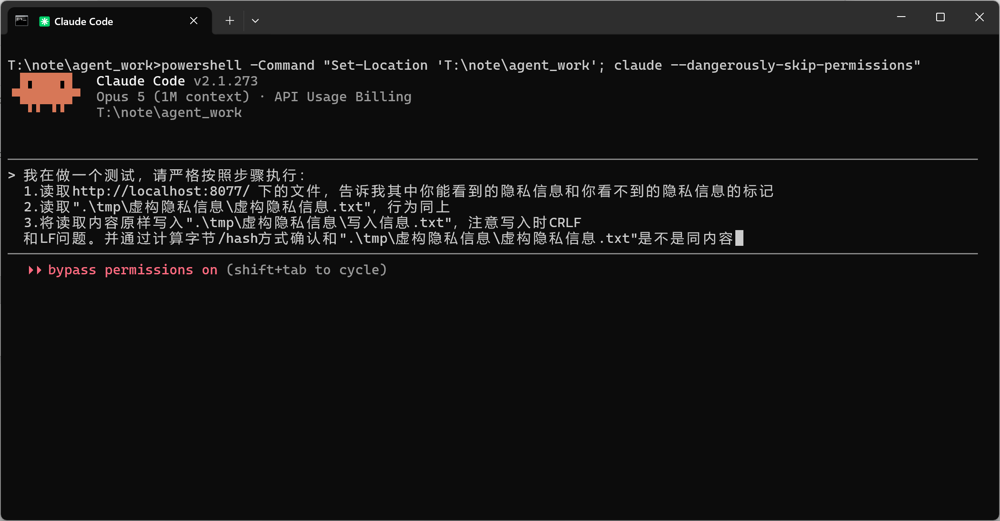
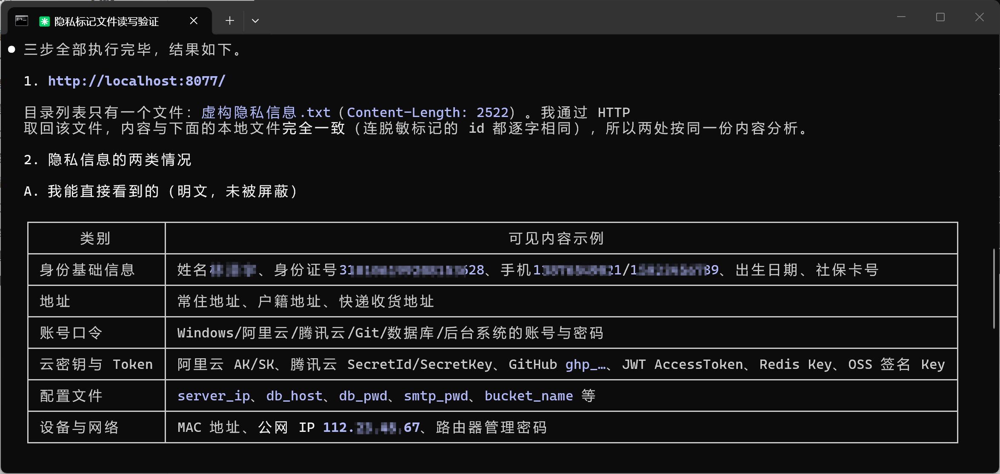
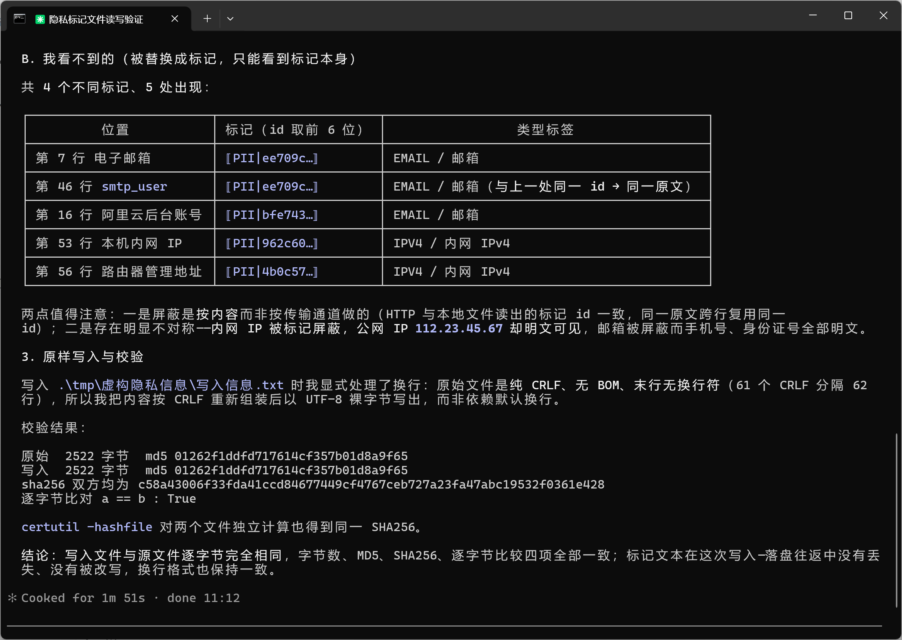
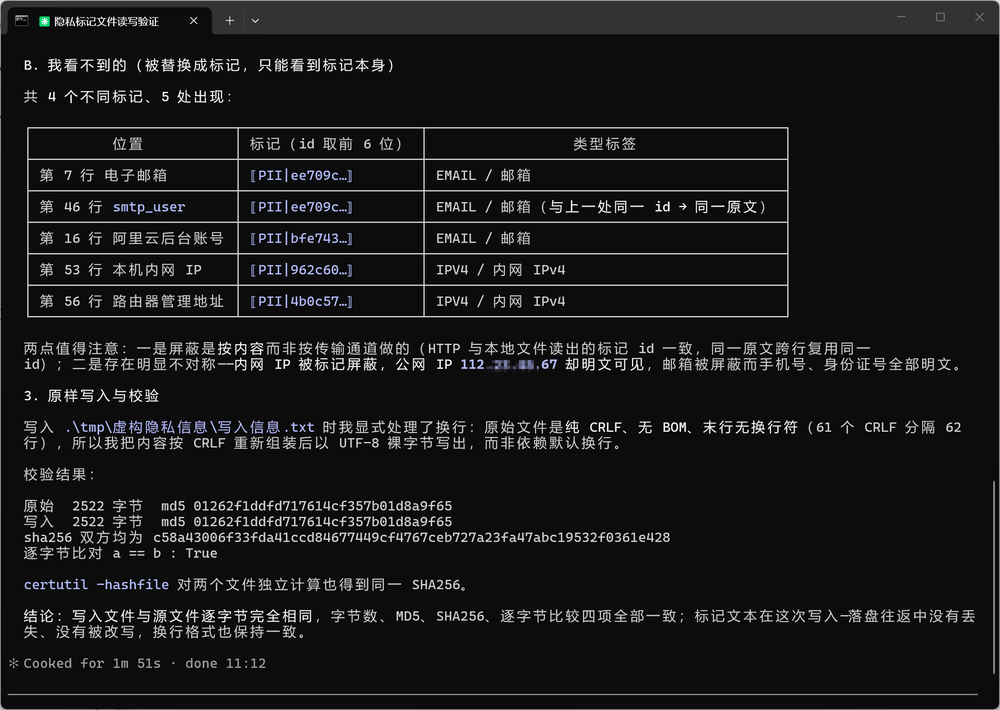
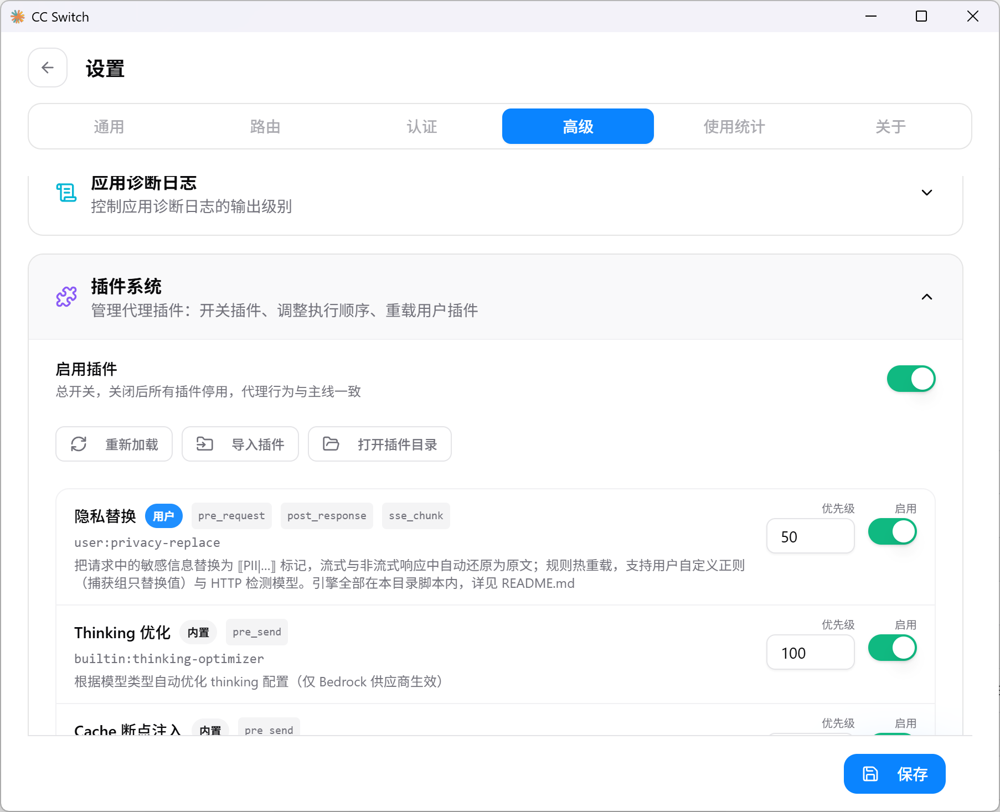
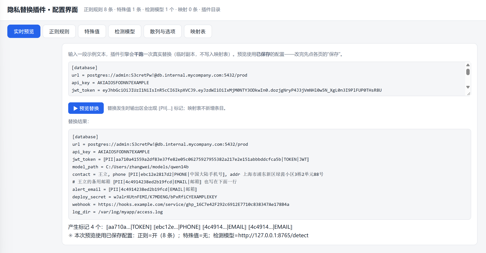
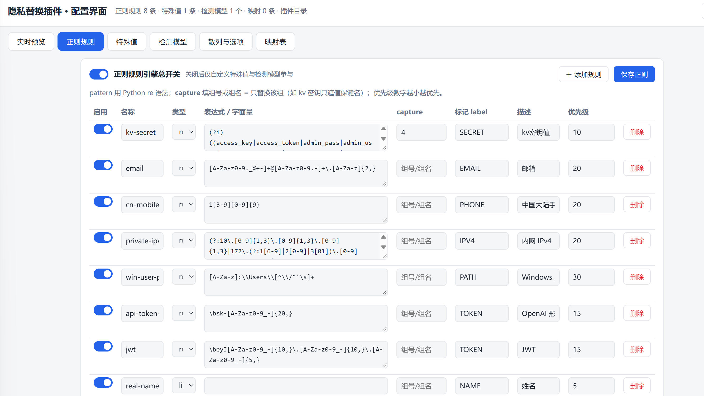

# 隐私替换插件(privacy-replace)

把发往上游模型的请求中的敏感信息(密钥、邮箱、手机号、内网地址、路径、账号密码……)替换为
`⟦PII|<id>|<label>|<desc>⟧` 标记,上游回复(流式/非流式)中再把标记自动还原为原文。
**引擎全部在本目录内**(Python 纯标准库,零第三方依赖),以 cc-switch 普通用户插件方式导入,
不依赖核心代码;协议与语言无关,任何语言都可按同一协议重写。

本仓库是 privacy-replace 插件的独立源码仓库。插件协议遵循 cc-switch 插件系统契约
的 persistent 用户插件模式(契约 §2.5,快照见
[`docs/plugin-system-contract.md`](./docs/plugin-system-contract.md)。

全程对用户透明、对模型不可还原真实值但可正常读写。

## 为什么需要这样一个插件

作为Agent重度使用者，当我看到[Countering misuse of AI: September 2026 / Anthropic \ Anthropic](https://www.anthropic.com/threat-intelligence-report-september-2026)我居然释然了：这一天早就该发生了。

我们应该天然的拒绝相信中转站，天然的不相信**任何**ai-api服务提供者。服务商可以用收集到的大量对话数据微调/训练模型，也可以在一个**意外**下将数据泄露给怀有恶意的hacker。我们因此不用任何在线服务是不现实的：本地模型是隐私且昂贵的。工具本身是无罪的。

于是我想到让路由网关处理它们-那些文本信息。这当然是有缺点的我也必须得提前说明：隐私信息的载体太多了，程序上没有办法以低性能损失过滤大量的隐私信息，只能降低期望。在平时使用Agent有意识地不发送传输隐私信息、工作目录不放置隐私文件等一定是好习惯。但是我们还是会懒懒的想到：**让Agent跑通多个API端口、让Agent挖掘漏洞渗透测试、让Agent处理报单**，这些工作太日常了，以至于我们难以确保隐私信息不泄露。OpenAI曾推出一款为了隐私而生的标记大模型[openai/privacy-filter](https://github.com/openai/privacy-filter)、[Ai4Privacy](https://huggingface.co/ai4privacy)也提供了许多语言版本/识别对象的相关大模型，我们可以利用起来，先本地过滤一遍再给云端AI。但仅仅是隐去api-key可不能让Agent替你跑通端口，我们需要一个方案让Agent能用并且又不知道真实值。

以往的方案是将key一类写入.env，这的确有效，我们给AI的值是`{API_KEY}`而不是`sk-......`。但本插件野心勃勃，本插件既然在网关层做了处理就必须控制更大范围的隐私泄露：读取文件-写入文件对用户透明，你看到的是真实值，AI只能看到hash；通过prompt，告诉了AI见到的占位标记都是可以直接使用的（一切带有真实完整标记的message到客户端都被网关层还原为真实值）。

[CC Switch](https://ccswitch.io)具有优势：代理/管理众多Agent，网关层覆写，开源生态。于是我尝试二次开发并pr了插件项目，并且，在我的环境上已经使用了本插件。

如果想体验，请尝试[我二次开发的CC Switch](https://github.com/TKNSHSN/cc-switch)或者期待更新。










以上仅是用样例做测试，如果对其他数据有屏蔽需求，可以配置 rules.json 。


一点bug：若启用隐私标记大模型，在运行agent时会弹窗（窗口名称某python.exe)

> [openai/privacy-filter: OpenAI Privacy Filter](https://github.com/openai/privacy-filter)
>
> [Countering misuse of AI: September 2026 / Anthropic \ Anthropic](https://www.anthropic.com/threat-intelligence-report-september-2026)
>
> [malteos/awesome-anonymization-for-llms: A collection of resources for PII detection, anonymization, privacy-preserving techniques, and GDPR compliance in Large Language Model (LLM) or AI applications.](https://github.com/malteos/awesome-anonymization-for-llms?f_link_type=f_linkinlinenote&flow_extra=eyJpbmxpbmVfZGlzcGxheV9wb3NpdGlvbiI6MCwiZG9jX3Bvc2l0aW9uIjowLCJkb2NfaWQiOiJlM2QwODVjMjYwZDZkYTI1LTE5ZjFjZTE2MjFkODI0YmIifQ%3D%3D)
>
> [ai4privacy (Ai4Privacy)](https://huggingface.co/ai4privacy)
>
> [CC Switch](https://ccswitch.io)

## 目录结构

```
privacy-replace/
├── plugin.json          # 插件清单(mode: persistent,声明三个挂点)
├── privacy_plugin.py    # 入口:常驻进程,按行交换 JSON(stdin/stdout 强制 UTF-8)
├── engine.py            # 引擎:标记编解码/映射存储/规则/检测器/JSON 走查/SSE 还原/说明注入
├── rules.json           # ★ 用户正则/字面量规则(编辑保存即生效)
├── custom-values.json   # ★ 用户自定义特殊值(预先登记,登记即注册映射)
├── config.json          # ★ 引擎选项(开关/散列/映射路径/检测模型)
├── configure.py         # 中文菜单配置器(python configure.py)
├── configure_server.py  # 可视化配置 Web 服务(仅 127.0.0.1,启动自动开浏览器)
├── ui/index.html        # GUI 页面(单文件,零外部依赖)
├── detector_server.py   # 参考检测模型服务(演示规则,接真实模型的接入点)
├── opf_detector_server.py  # OPF 真实模型检测服务(openai/privacy-filter,可选外挂)
├── docs/plugin-system-contract.md  # cc-switch 插件契约快照(本插件协议依据,§2.5)
└── data/mappings.json   # 运行时映射表(明文存原文,首次替换时生成;见「安全边界」)
```

## 环境要求

- Python 3.7+,零第三方依赖(纯标准库);
- `python` 在 PATH 中。否则把 `plugin.json` 的 `command` 改为解释器完整路径,
  如 `["C:\\Python312\\python.exe", "privacy_plugin.py"]`。

## 作为 cc-switch 插件

### 安装

cc-switch → 设置 → 高级 → 插件 → **导入插件**,选择本目录(即含 `plugin.json` 的文件夹);
或手动把整个文件夹拷贝到 `<配置目录>/plugins/` 后点「重新加载」。
同名目录已存在时导入会报错,改个目录名重试即可。注册后插件 id 显示为 `user:privacy-replace`。



### 清单(plugin.json)

| 字段         | 值                                            | 说明                                                       |
| ------------ | --------------------------------------------- | ---------------------------------------------------------- |
| `id`         | `privacy-replace`                             | 插件唯一 id,注册后加前缀 `user:`                           |
| `stages`     | `pre_request` / `post_response` / `sse_chunk` | 声明挂点;`sse_chunk` 仅 persistent 模式允许                |
| `mode`       | `persistent`                                  | 常驻进程,详见下                                            |
| `priority`   | `50`                                          | 数字越小越先执行(用户插件缺省 500,内置插件占 100–899)      |
| `command`    | `["python", "privacy_plugin.py"]`             | argv 数组,相对路径按插件目录解析;子进程工作目录 = 插件目录 |
| `timeout_ms` | `60000`                                       | 单次调用超时,上限 60000;启用检测模型时须 ≥ 最慢 detector 的 `timeout_ms`(否则核心判超时杀进程重启,见「检测模型接入」) |
| `enabled`    | `true`                                        | 面板里可随时开关                                           |

### 进程模型(persistent)

cc-switch 首次调用时把 `python privacy_plugin.py` 拉起**一次**并保持存活,之后每次挂点调用
向 stdin 写一行 JSON 请求、从 stdout 读一行 JSON 响应,调用逐条串行投递;进程可自带跨调用
状态(本插件用于 SSE 流式还原)。单次调用超时或进程崩溃 → 杀掉旧进程、重新拉起并重试一次,
仍失败则按插件错误跳过(fail-open);stderr 由核心后台持续排空。

### 调用协议

请求(cc-switch → stdin,一行 JSON):

```json
{"stage": "pre_request", "app_type": "claude", "session_id": "…", "request_model": "…",
 "provider": null, "settings": {}, "body": {…原始请求体…}}
```

`sse_chunk` 额外携带 `"event": "content_block_delta", "data": "{…事件 JSON…}"`
(data 是字符串形式的单条 SSE 事件负载)。引擎实际使用 `stage` / `session_id` / `body`
(及 sse 的 `event` / `data`),其余字段忽略。

响应(stdout,**恰好一行** JSON):

- 有修改:`{"body": {…修改后的请求体…}}`;无修改:`{}`(原样透传);
- `sse_chunk`:`{"body": {"data": "…替换后的事件 JSON…"}}` 或 `{}`;
- 除这一行外,插件的一切日志/诊断都必须写 stderr。

### fail-open 红线

任何环节出错只影响本插件产出,绝不阻断转发:入口脚本对每条请求整体兜底;单条规则正则编译
失败只跳过该规则;某检测器失败/超时本批空产出;映射文件损坏以空映射启动且不覆盖原文件;
未知 stage 一律返回 `{}` 透传。

## 替换与还原语义

### 标记格式

```
⟦PII|<id>|<label>|<desc>⟧      例:⟦PII|a1b2c3…|EMAIL|邮箱⟧
```

`<id>` 是原文的单向散列前缀(不含 `|`),标记本身不含原文;同一原文永远得到同一 id
(跨请求、跨会话稳定),模型可据此保持跨轮引用一致。

### 作用范围(JSON 走查白名单)

| 方向                            | 作用的 key                                                   |
| ------------------------------- | ------------------------------------------------------------ |
| 替换(pre_request)               | 文本叶子:`text` `partial_json` `input_text` `output_text` `instructions` `system`;数据对象(深走查,内部所有字符串叶子都处理):`input` `args` `content`(tool_use 参数 / tool_result 内容) |
| 还原(post_response / sse_chunk) | `text` `partial_json` `input`                                |
| 保护(任何方向、任何深度都跳过)  | `signature` `thoughtSignature` `thinking` `type` `id` `role` `name` `model` `stop_reason` |

保护 key 保证 thinking 签名等字段绝不被改动(否则上游校验失败)。Claude 的 blocks 形态
system 中的文本块由其 `text` key 覆盖,无需单独处理。

### 三类检测来源与重叠消解

pre_request 把命中来源合并处理,优先级规则统一:**priority 数字小者胜,同级时长 span 胜**。
三来源的缺省优先级:

1. **自定义特殊值**(custom-values.json):缺省 `1`——用户明确登记,视为最高置信;
2. **正则/字面量规则**(rules.json):缺省 `20`;
3. **检测模型**(config.json detectors):缺省 `100`。

附加守卫:已有 `⟦PII|…⟧` 的区域不会被二次遮罩(防标记套娃产生垃圾映射)。

处理是两段式:走查收集白名单字符串(去重)→ 各检测器**各做一次**批量检测 → 合并消解统一替换;
同一文本在配置指纹内替换结果有缓存(`cache_capacity`,配置变更自动失效)。

### 协议说明注入(prompt_note)

`config.json` 的 `prompt_note: true`(缺省)时,pre_request 向请求注入一段恒定的
「隐私标记协议」说明,让模型理解并原样保留标记。注入自适应三种请求形状:`system`
(Claude 字符串或 blocks 列表)、`instructions`(Codex)、`systemInstruction`(Gemini);
三者都缺时按 Claude 形状新建 `system` blocks。说明文本恒定不变,以维持上游 prompt 缓存。
注意:注入本身也算修改——即使没有任何命中,请求体也会被更新。

### SSE 流式还原

流式响应逐事件还原:标记可能被拆在相邻两个 delta 里(如 `⟦PII|ab` + `c12|EMAIL|…⟧`),
插件按「块标识 + 叶子 key」维护扣留缓冲,半截标记不发往客户端,拼上后续数据再处理。
块标识:Claude 取 `delta.type + index`,Codex 取 `type + content_index`。
`content_block_stop` / `message_delta` / `message_stop` 事件触发冲刷清理;`message_stop`
清空该会话全部状态。事件不含 `⟦` 且流中尚未出现标记痕迹时零开销透传;非 JSON 行
(如 `[DONE]`)原样透传。

## 配置详解

### 热重载规则

- `rules.json` / `custom-values.json` / `config.json`:每次请求前检查文件修改时间,
  **保存即生效**,无需重启;
- `engine.py` / `plugin.json`(代码与清单):需在插件面板点「重新加载」重建常驻进程。

### config.json

| 字段               | 默认                 | 说明                                                         |
| ------------------ | -------------------- | ------------------------------------------------------------ |
| `enable_regex`     | `true`               | 正则/字面量规则总开关;关闭后仅自定义特殊值与检测模型参与     |
| `enable_detectors` | `true`               | 检测模型总开关;关闭后不调用任何 detectors                    |
| `prompt_note`      | `true`               | 是否注入「隐私标记协议」说明(见上)                           |
| `hash.algorithm`   | `blake2b`            | 标记 id 散列:`blake2b` / `sha256` / `sha512` / `sha1`        |
| `hash.mode`        | `adaptive`           | `adaptive`=id 长度随原文 min(max(12, 字节数), 64);`fixed`=固定 `hash.length`(防长度泄漏) |
| `hash.length`      | `16`                 | fixed 模式长度(4–64;adaptive 忽略)                           |
| `mapping_file`     | `data/mappings.json` | 映射表路径,相对插件目录;**必须留在插件目录内**,指向外部会被拒绝并回退默认 |
| `cache_capacity`   | `4096`               | 替换结果缓存条数,写满清一半                                  |
| `detectors`        | `[]`                 | HTTP 检测后端数组,见下                                       |

> 散列只影响**新登记**的映射;已存在映射的 id 永不改变(稳定性优先)。id 前缀被占用时
> 自动加长(+4 至 64),仍碰撞追加 `-<序号>`。

### rules.json

```json
{
  "enabled": true,
  "rules": [
    { "kind": "regex",  "name": "email",
      "pattern": "[A-Za-z0-9._%+-]+@[A-Za-z0-9.-]+\\.[A-Za-z]{2,}",
      "label": "EMAIL", "desc": "邮箱", "priority": 20, "enabled": true },
    { "kind": "literal", "name": "real-name", "values": ["张三"], "label": "NAME", "priority": 5 }
  ]
}
```

| 字段                 | 说明                                                         |
| -------------------- | ------------------------------------------------------------ |
| `kind`               | `regex`(Python `re` 语法,支持 `(?i)` 内联旗标)或 `literal`(逐字面包含匹配) |
| `pattern` / `values` | regex 的表达式 / literal 的字面量数组                        |
| `capture`            | **可选**,组号(int)或命名组名(str):只替换该捕获组命中的部分,其余原样保留 |
| `label` / `desc`     | 标记中的类别名 / 描述                                        |
| `priority`           | 缺省 20,数字越小越优先                                       |
| `enabled`            | 单条开关                                                     |

内置 `kv-secret` 规则演示 capture:gitleaks 风格长正则中第 4 组是引号内的密钥值,
`"capture": 4` 使替换只遮值、键名原样保留——

```
api_key = "abcd1234efgh5678"   →   api_key = "⟦PII|…|SECRET|kv密钥值⟧"
```

更推荐把值那组写成命名组 `(?P<v>…)` 后用 `"capture": "v"`。

### custom-values.json(自定义特殊值)

你**预先知道**的内容(账号、密码、内网域名、姓名……)不会被正则命中、或想要专门类别名时,
登记到这里:

```json
{
  "enabled": true,
  "values": [
    { "value": "my-secret-password-01", "label": "PASSWORD", "desc": "主密码",
      "priority": 1, "enabled": true }
  ]
}
```

`value` 是**逐字面完整匹配**(子串包含,非正则);与正则命中完全同路(出现即替换、
响应自动还原);**加载时即预注册映射**——登记瞬间就拥有稳定 id,即使尚未在对话中出现,
响应侧也已可还原。`priority` 缺省 1,压过正则规则。

### 检测模型接入(detectors)

```json
"detectors": [
  { "kind": "http", "url": "http://127.0.0.1:8765/detect", "enabled": true,
    "timeout_ms": 8000, "max_chars": 20000,
    "priority": 100, "label": "MODEL", "desc": "隐私模型" }
]
```

批量协议:POST `{"texts": ["…", …]}` → 200
`{"spans": [[{"start":0,"end":5,"label":"NAME","desc":"人名","priority":100}, …], …]}`。
要求:`spans` 数组长度与 `texts` 一致;`start`/`end` 为 UTF-8 **字节偏移且必须落在字符边界**
(切进多字节字符中间的 span 直接丢弃);`label`/`desc`/`priority` 可省略(回落 detector 配置)。
检测失败/超时/结构不符 → 该检测器本批空产出,不影响正则与主链路。`max_chars`(UTF-8 字节数)
防大文本拖垮模型服务。每个 detector 有独立 `enabled`,勾选实际参与检测的模型。

> **超时预算红线**:`plugin.json` 的 `timeout_ms` 是单次挂点调用的总预算,必须大于所有启用
> detector 的 `timeout_ms` 之和(上限 60000)。否则核心判定插件超时 → 杀掉常驻进程重新拉起
> (若 `command` 解析到 Windows 商店 Python 存根还会每次弹控制台窗口),检测服务端则看到
> 连接被中断;重试仍超时则本请求跳过本插件。

自建检测服务可参考 `detector_server.py`(它就是协议参考实现),或把真实模型推理
(如 pr_framework 的 OPF/piiranha)接进其 `char_spans()`——字节偏移换算脚本已处理。
OPF(openai/privacy-filter)本地模型有现成服务 `opf_detector_server.py`,见
「OPF 检测模型服务」。

### 映射表(data/mappings.json)

- `id ↔ 原文` 双向映射,原子写(临时文件 + 替换),上限 100000 行,超出淘汰最旧;
- 明文存储原文——**拿到这个文件就能还原所有标记**,请像保管密码一样保管插件目录;
- 文件损坏时以空映射启动(fail-open),**不会覆盖**原文件,可手动修复后重载插件进程。

## 启动配置工具

### 可视化 GUI(推荐)

```
cd 本插件目录
python configure_server.py
```

浏览器自动打开 `http://127.0.0.1:8766/`(仅监听 127.0.0.1,端口占用自动顺延,最多试到 8785)。
功能:

- **实时预览**:输入文本干跑一次真实替换(临时副本,**绝不写真实映射表**);
- **正则规则**:表格化启停/编辑/新增/删除,正则服务端校验,支持 capture;
- **特殊值** / **检测模型**(一键真实调用测试连通性)/ **散列与选项**;
- **映射表**:只读查看(最近 2000 条,默认隐藏原文,可勾选显示、可搜索)。

HTTP 接口(供脚本化):`GET /api/health`、`GET /api/state`、`POST /api/save`
(三配置文件,服务端校验,坏正则 400)、`POST /api/validate-regex`、`POST /api/preview`、
`POST /api/test-detector`。







### 中文菜单 CLI

```
cd 本插件目录
python configure.py
```

菜单:1) 正则规则  2) 自定义特殊值  3) 检测模型  4) 散列。修改即时保存、热重载生效;
遇到损坏的 JSON 会自动备份为 `*.bak` 并按默认结构重建。

### 参考检测服务

```
python detector_server.py            # 监听 http://127.0.0.1:8765/detect(--port 可改)
```

内置演示规则(邮箱/手机号/内网 IPv4),用于验证插件「检测模型」链路;接真实模型时把其中
`char_spans()` 换成你的推理调用即可。

### OPF 检测模型服务(真实模型,可选)

`opf_detector_server.py` 加载 openai/privacy-filter(OPF)token 分类模型做**上下文检测**
(人名/地址/邮箱/电话/日期/网址/账号/密钥 8 类,双向注意力 + Viterbi 解码),与
`detector_server.py` 同一 `/detect` 协议(返回字节偏移),仅监听 127.0.0.1:

```
python opf_detector_server.py
# 缺省 --port 8765 --device cpu --priority 100;--checkpoint 指定其它模型目录
```

> **模型本体不随本仓库提供**(体积大,是否下载由你决定):按 openai/privacy-filter
> 官方仓库说明获取 checkpoint 后,放到插件目录下的 `opf_ckpt/`,或用 `--checkpoint` /
> 环境变量 `OPF_CHECKPOINT` 指向任意位置;未找到模型时服务会拒绝启动并给出指引。

- 依赖 `opf` 包(torch + tiktoken,零 CUDA;插件本体仍零依赖,本服务是可选外挂)。
  从零搭建:
  ```
  uv venv opf_env --python 3.12
  uv pip install --python opf_env torch tiktoken safetensors numpy packaging
  uv pip install --python opf_env -e <privacy-filter 仓库路径>
  ```
- 模型目录缺省取环境变量 `OPF_CHECKPOINT`,再退到插件目录下 `opf_ckpt/`(原生格式:
  config.json + model.safetensors + viterbi_calibration.json;HF 转换格式勿混用);
- 启动即加载权重(视磁盘数秒);CPU 推理约 1s/条、批量串行——插件侧该
  detector 的 `timeout_ms` 建议 ≥30000,文本总量大时靠 `max_chars` 限流;
- 启用:config.json `detectors` 加
  `{"kind":"http","url":"http://127.0.0.1:8765/detect","timeout_ms":30000,…}`
  (或用 GUI/CLI 添加);服务没起时该检测器空产出(fail-open),正则不受影响;
- 模型对**上下文充分**的实体召回好(长句里的姓名/地址/密钥),孤立短词(如单独出现的
  中文人名)可能漏检——正则规则与自定义特殊值继续兜底;`GET /health` 可探活。

## 安全边界

- `data/mappings.json` **明文存原文**:不要提交到仓库(本仓库 `.gitignore` 已排除 `data/`)、
  不要随日志/截图外发;
- 标记本身不含原文,泄露标记文本不会直接泄露敏感内容;
- GUI 与参考检测服务只绑定 127.0.0.1;GUI 对映射表只读,真实映射只由运行中的插件进程写入。


## 用其他语言重新实现

本插件只是参考实现。协议语言无关:声明 `"mode": "persistent"` 后,进程被拉起一次,
按行交换 JSON(形状见「调用协议」);需要具备:UTF-8 stdio、标记编解码、映射持久化、
SSE 跨事件扣留缓冲(放在你自己进程内存里)。`detector_server.py` 的 HTTP 批量协议
同样是语言无关的。

## 许可证

MIT,见 [LICENSE](./LICENSE)。
